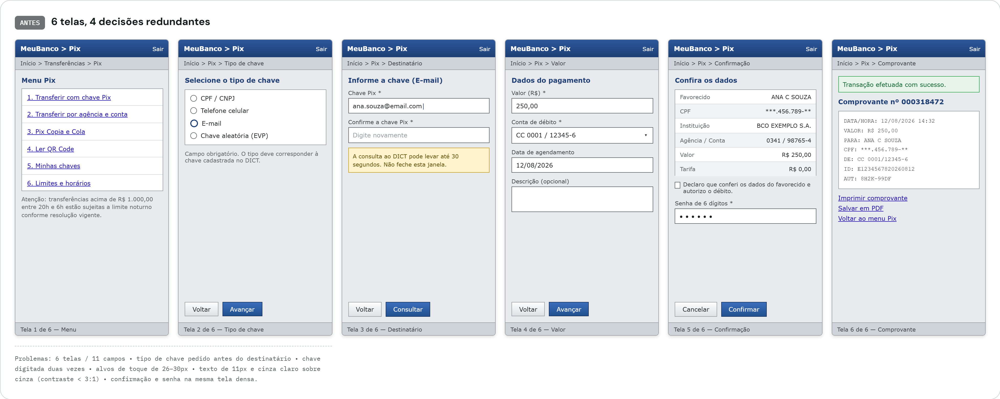
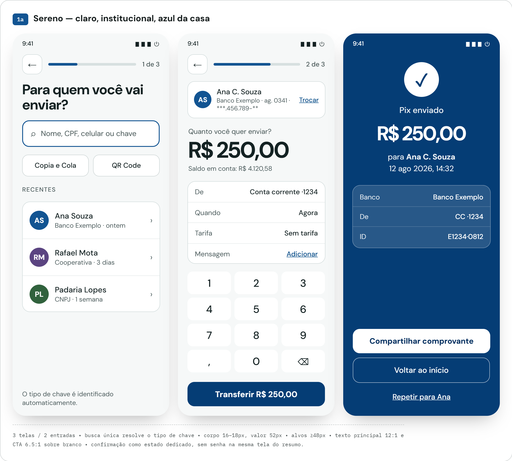

# SuperApp Agentic Lab

A study lab with a dual goal: (1) redesign the **Pix Transfer** journey of a
fictional banking super-app and (2) validate, in practice, a specification-
driven development workflow (SDD) executed by specialized AI agents — from
the business requirement all the way to code review, going through
implementation, tests, and an accessibility audit.

This repository (`superapp-agentic-workflow`) holds the project context, the
SDD workflow, the skills, and the subagents. The actual implementation lives
in three satellite repositories:
[`superapp-ios`](https://github.com/DoniDevRs/superapp-ios),
[`superapp-design-system`](https://github.com/DoniDevRs/superapp-design-system),
and [`superapp-api`](https://github.com/DoniDevRs/superapp-api).

## The problem

The original fictional Pix flow ("MeuBanco") had 6 screens and 11 fields to
complete a transfer: menu → key type → recipient (with the Pix key typed
twice, for confirmation) → amount → confirmation (with the password on the
same dense review screen) → receipt. The key type was asked *before* knowing
who the recipient was — a redundant decision, since the type can be inferred
from the value typed in.

There were also structural accessibility problems: touch targets of
26–30px (below the recommended 44×44pt), 11px text in light gray on gray
(contrast below 3:1, when WCAG 2.1 AA requires 4.5:1 for normal text), and a
final screen that mixed data review with password entry.

That scenario, documented below, was the starting point for the spec at
[`specs/pix-transfer-redesign/spec.md`](specs/pix-transfer-redesign/spec.md).



## Architecture

The workflow follows a linear pipeline, where each stage produces a
reviewable artifact before the next one begins:

```
Business Requirement
        │
        ▼
      SPEC        specs/pix-transfer-redesign/spec.md
        │          (the what and why — no implementation details)
        ▼
      PLAN        specs/pix-transfer-redesign/plan.md
        │          (modules, contracts, Design System components, risks)
        ▼
      TASKS       specs/pix-transfer-redesign/tasks.md
        │          (small, verifiable units of work)
        ▼
   Implementation  Domain → Data → Presentation → Coordinator
        │          (ios-feature skill)
        ▼
      Tests        ViewModel/UseCase unit tests
        │          (test-generation skill, qa-engineer subagent)
        ▼
Accessibility Audit VoiceOver, Dynamic Type, contrast, hit area
        │           (accessibility-audit skill + performAccessibilityAudit())
        ▼
   Code Review      retain cycles, threading, Clean Architecture, duplication
                    (ios-reviewer subagent)
```

The golden rule of the workflow: if an agent finds ambiguity at any stage, it
goes back to the previous stage's artifact and clarifies it there — never
resolving the ambiguity "in the code" during implementation. That actually
happened during the project: the approved prototype consolidated the
"Amount" and "Review" steps of the original spec into a single screen, and
`plan.md`/`tasks.md` were updated to reflect that decision before
implementation proceeded, instead of the divergence being resolved silently
in the code.

**Clean Architecture + MVVM-C.** The `Pix` module is split into three
layers — Domain (entities and use cases, with no dependency on
UIKit/SwiftUI/networking), Data (repository implementations on top of Core's
networking, mapping transport errors to domain error types), and
Presentation (SwiftUI + a single `PixViewModel` shared across the flow's
three screens, avoiding manual state relaying between ViewModels).
Navigation is never done directly by the View: a `PixCoordinator` (UIKit,
`UINavigationController`) receives intents via closures
(`onRecipientSelected`, `onTransferConfirmed`, etc.) and decides where to go
— a rule enforced both in `CLAUDE.md` and in the `ios-reviewer` subagent's
checklist.

## What was built

- **UIKit + SwiftUI** — navigation via the Coordinator pattern (UIKit)
  wrapping screens built in SwiftUI (`UIHostingController`)
- **Multi-repo + SPM** — 4 repositories (`superapp-agentic-workflow`,
  `superapp-ios`, `superapp-design-system`, `superapp-api`), with the iOS
  app organized into Swift Package Manager packages (`App`,
  `Packages/Core`, `Packages/Pix`) consuming the `SuperAppDesignSystem`
  package as an external dependency
- **A dedicated Design System** — text field, selection list, button, and
  banner components reused from `superapp-design-system` instead of being
  recreated locally in the Pix module
- **Java backend (Spring Boot)** — `superapp-api` exposes `PixController`,
  `AccountController`, and `ContactController`, with DTOs, services, and
  domain exceptions (`InsufficientBalanceException`,
  `RecipientNotFoundException`) over mocked data
- **Unit tests** — coverage of `PixViewModel` and the Pix module's Domain
  layers, plus the Core module's existing tests
- **WCAG 2.1 AA** — VoiceOver, Dynamic Type, contrast, and minimum touch
  area as acceptance criteria, not an optional polish item

## Agentic workflow

**`CLAUDE.md` as persistent context.** It defines the project's
architecture, the mandatory SDD workflow (spec → plan → tasks → implement →
test), and the rules every agent follows regardless of the task — never
create navigation outside the Coordinator, never duplicate a Design System
component, always require ViewModel tests and accessibility on new screens.
It's read before any implementation, not just consulted on demand.

**3 skills, each with a specific role:**
- [`ios-feature`](skills/ios-feature/SKILL.md) — orchestrates the
  implementation sequence for a new feature: read the spec, check the
  Design System before creating a component, follow Clean Architecture +
  MVVM-C, generate tests alongside the implementation, and close with an
  accessibility check
- [`test-generation`](skills/test-generation/SKILL.md) — standardizes
  ViewModel tests (mock of the corresponding repository/service, happy path
  + at least 2 error scenarios, `test_<condition>_<expectedResult>` naming
  convention)
- [`accessibility-audit`](skills/accessibility-audit/SKILL.md) — a WCAG
  2.1 AA checklist (clear accessibility label, Dynamic Type, 4.5:1
  contrast, 44×44pt touch area, VoiceOver reading order) run before
  considering any screen done

**2 scoped subagents, both read-only (except for running tests):**
- [`ios-reviewer`](.claude/agents/ios-reviewer.md) — reviews retain cycles,
  threading violations, Clean Architecture violations, and code duplication
  in the Pix module. Never edits files or suggests that another tool do so
  in its place — it only reports findings by severity
- [`qa-engineer`](.claude/agents/qa-engineer.md) — runs the existing test
  suite, analyzes coverage by reading code, and flags untested edge cases
  (negative amounts, malformed Pix keys, network timeouts, balance exactly
  equal to the transfer amount). Has access to `Bash` only to run
  test/inspection commands, never to write test files or change
  dependencies

**GitHub integration via MCP.** The workflow generated real issues in the
`superapp-ios` repository, not just internal markdown tasks:
- [Issue #1](https://github.com/DoniDevRs/superapp-ios/issues/1) — *"Survey
  of existing Design System components"*, the planned task from Phase 0 of
  `tasks.md`, opened before any Domain code was written, to avoid
  duplicating a visual component
- [Issue #2](https://github.com/DoniDevRs/superapp-ios/issues/2) — a real
  bug found during development: tapping recent recipients didn't navigate
  to `ReviewPaymentView`. The issue documents the investigation (the
  `Button` → `PixViewModel` → `PixCoordinator` wiring reviewed and found
  correct by reading the code, an `XCUITest` that passes but doesn't
  reproduce the problem with a synthetic tap) and raises the hypothesis of
  a race condition between the list loading and the gesture recognizers
  being installed — the kind of finding that only shows up when actually
  testing the app, not just reading the code

## Before / After

| | Before | After |
|---|---|---|
| Screens | 6 | 3 |
| Fields/inputs | 11 | 2 |
| Touch target | 26–30px | ≥48px |
| Contrast (primary text) | <3:1 | 12:1 |
| Pix key | typed twice | inferred from a single search |
| Confirmation | password on the same dense review screen | dedicated state, no password mixed into the summary |




Navigable prototype at [`design/prototype/index.html`](design/prototype/index.html).

## Accessibility Audit

Before closing out the feature, the 3 screens (`SelectRecipientView`,
`ReviewPaymentView`, `ConfirmationView`) went through two passes: the
`accessibility-audit` skill's static checklist and a new UI test
(`AccessibilityAuditUITests.swift`) that runs
`XCUIApplication().performAccessibilityAudit()` while navigating the full
Select → Review → Confirmation flow. Together, the two passes found and
fixed:

- **Insufficient hit area** — the "Change" and "Repeat for {name}" text
  buttons had `frame(minWidth:minHeight:)` but no `contentShape`, meaning
  the larger frame didn't expand the actually tappable region. Confirmed
  by the audit itself ("Hit area is too small").
- **Ungrouped accessibility elements** — the recipient summary in
  `ReviewPaymentView` combined an avatar-initials `Text`
  (`accessibilityHidden`) with the visible name/bank text without grouping
  them, which the audit flagged as "potentially inaccessible text". Fixed
  by grouping them into a single `accessibilityElement(children: .combine)`,
  keeping the "Change" button as a separate, independently focusable
  element.
- **Insufficient contrast in dark mode** — `PixTheme.error` was a fixed
  color (~2.66:1 in dark mode, below the required 4.5:1); made light/dark
  adaptive.
- **Decorative icons missing `accessibilityHidden`** — the search,
  chevron, and error-triangle icons produced VoiceOver stops with no
  useful label.
- **VoiceOver reading order** — the error banner in `SelectRecipientView`
  is an `.overlay` and by default is read last by VoiceOver despite being
  visually on top; fixed with `accessibilitySortPriority`.
- **Dynamic Type ignored** — the status icons in `ConfirmationView` used a
  fixed `.font(.system(size: 56))`; replaced with `@ScaledMetric`.

The root cause of one of the Dynamic Type-related findings wasn't in the
Pix module, but in the **Design System**: `DSFont` was built via
`UIFontMetrics.scaledFont(for:)` wrapped in `Font(uiFont:)`, which rendered
at the correct size but didn't carry the text-style association metadata
that `performAccessibilityAudit()` inspects — as a result, every `Text`
using `DSFont` was flagged with "Dynamic Type font sizes are unsupported".
The fix required a commit in `superapp-design-system`, rebuilding `DSFont`
on `@ScaledMetric` (public API unchanged), not just in `superapp-ios`.

**Final result:** rerunning `performAccessibilityAudit()` on the flow's 3
screens after the fixes — **0 findings**, down from a failure on every text
element using `DSFont` before the Design System fix.

## Results

- **23 unit tests** (21 in the Pix module + 2 in the Core module) + **3 UI
  tests** (2 existing regression tests, relabeled after the
  accessibilityLabel change from "Change" to "Change recipient", and the
  new accessibility audit test) — all passing.
- The end-to-end process was followed without skipping a stage: spec →
  plan → tasks → layered implementation (Domain → Data → Presentation →
  Coordinator) → tests → accessibility audit → fix → clean retest. The one
  divergence found along the way (consolidating two screens from the
  original spec into one) was resolved by updating `plan.md` and
  `tasks.md` before proceeding, not silently in the code — exactly the
  behavior the SDD golden rule requires.
